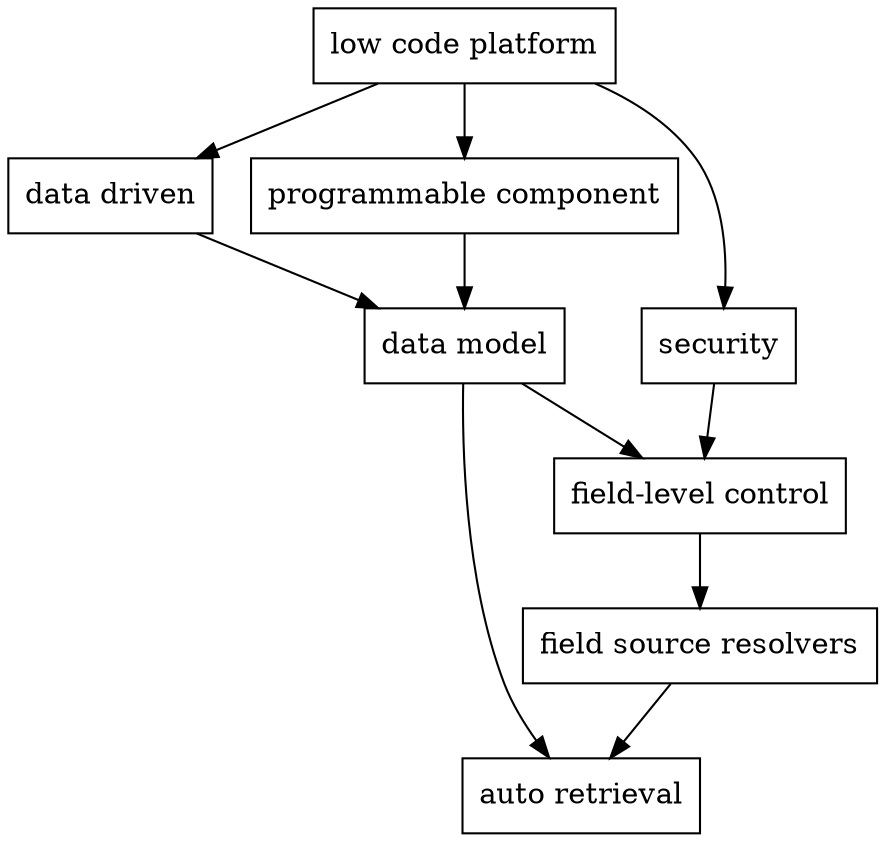

# data-driven-low-code

This is a proposal

Current days the speed of development is still too slow. I have been thinking what kind of breakthrough we need to supercede the traditional way of writing codes. Is it a low-code platform? What kind of low-code platform.

When I look at my daily coding jobs on business logic level, at most of the time we are simply doing data retrival, data re-mapping and data transfer, and that's all. So it is clear that the low-code platform should do all these things. But, in what way?

Answer: data-driven.

Data-driven means that the context of **data** is the foundation of the whole system. A clean, well-managed database of data models and its relationships lays the foundation of the system. Also, the security control should be based on field level. All data has a mangaed belonged model. Every model field and its origin is well tracked.

Data models is also the interface to connect different components of this low-code platform.

